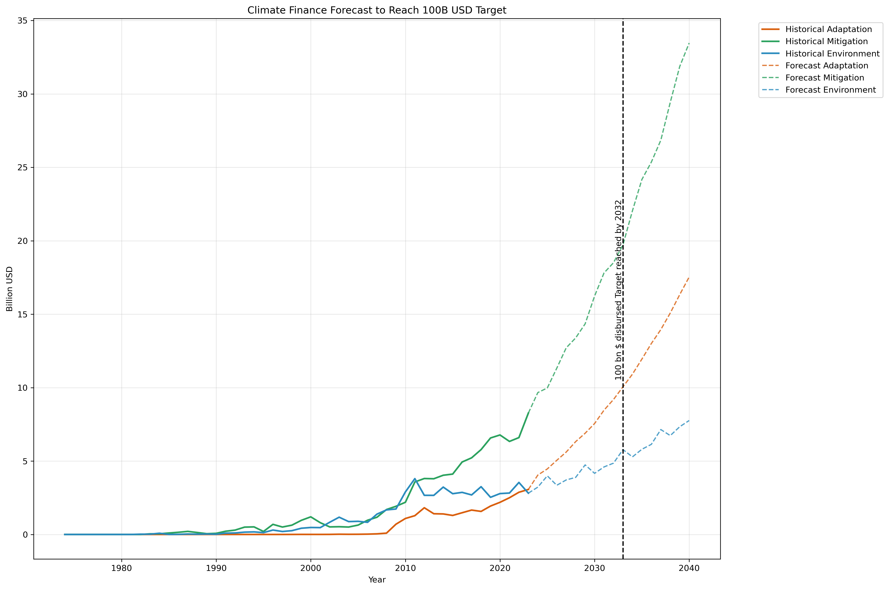
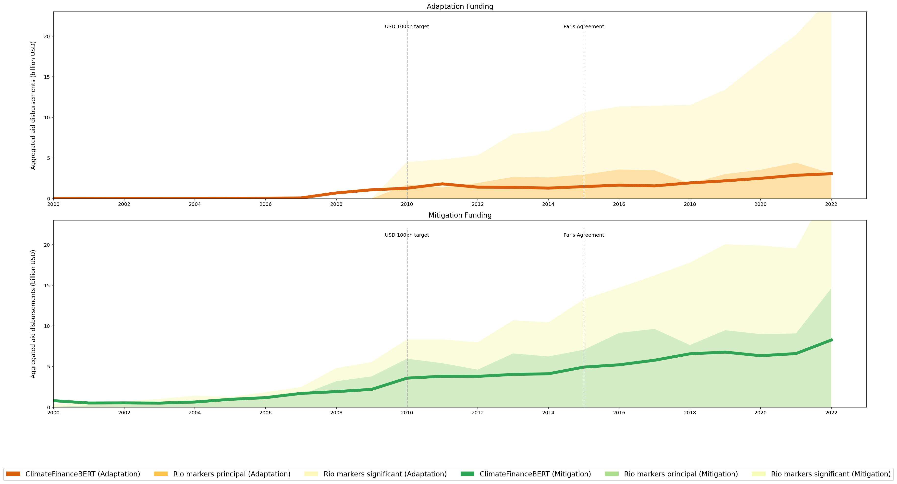
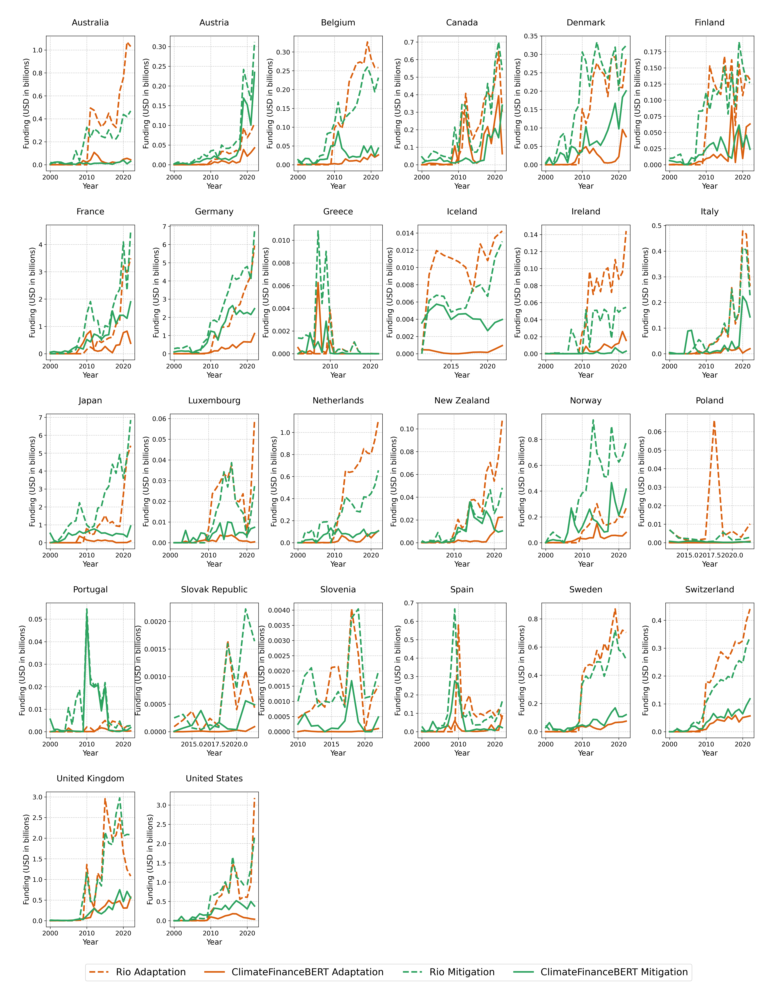
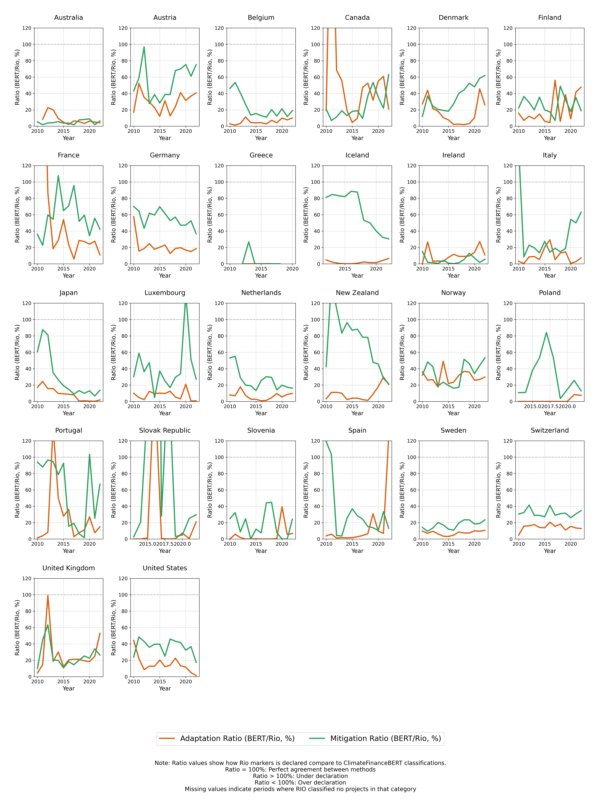
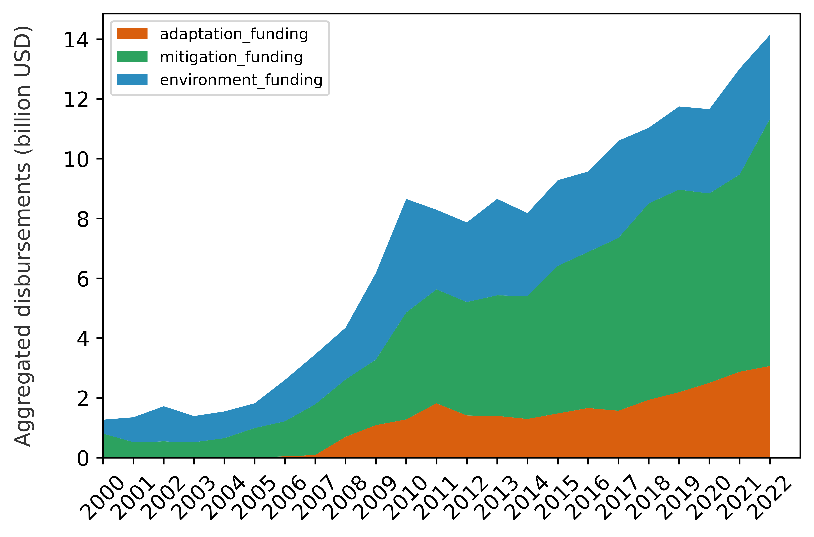
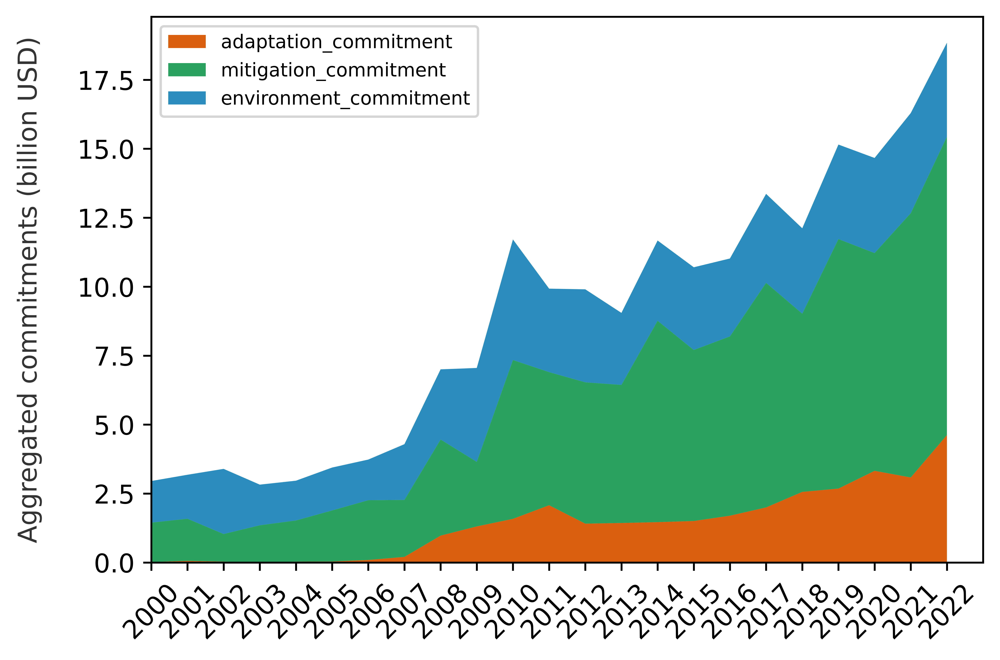

# Graphical Outputs for Climate Finance Estimation and Classification

This folder contains all key figures produced by the Climate Finance Estimation and Classification Pipeline. Below you will find a visual summary of each graph along with its description. These images are intended for academic publications, presentations, and further analysis.

---

## Graphical Outputs

### 1. Climate Finance Forecast (SARIMA)

- **Description:**  
  This graph presents a time series forecast of climate finance disbursements using a SARIMA model. Historical funding trends are plotted alongside forecasted values, with a vertical line indicating the projected year when a specific funding target is met.

---

### 2. Combined Adaptation & Mitigation Plot

- **Description:**  
  A dual-panel figure that displays adaptation funding (upper panel) and mitigation funding (lower panel). Each panel shows a stacked area chart representing different funding components along with an overlaid trend line. This plot facilitates a side-by-side comparison of adaptation and mitigation financial flows over time.

---

### 3. Combined Climate Finance Analysis

- **Description:**  
  This comprehensive multi-panel figure offers an in-depth analysis of climate finance. It includes panels that display overall disbursements, commitments, trends, and seasonal decompositions (trend, seasonal, and residual components) for each climate category (Adaptation, Mitigation, Environment).

---

### 4. Combined Comparison by Donor

- **Description:**  
  This figure provides a donor-level comparison between two classification methods (e.g., Rio markers vs. ClimateFinanceBERT). The graph is organized into multiple subplots (one per donor), allowing for detailed inspection of discrepancies or agreements in project classification across different donor entities.

---

### 5. Ratio Comparison by Donor

- **Description:**  
  A donor-level ratio comparison graph showing the proportion of projects classified by ClimateFinanceBERT relative to those classified by Rio markers. A horizontal reference line at 100% helps to interpret over- or under-declaration tendencies in the data.

---

### 6. Stacked Area Plot – Adaptation Commitments

- **Description:**  
  This stacked area plot visualizes the annual adaptation funding commitments. Different funding components are shown in separate layers, with an overall trend line indicating changes over time.

---

### 7. Stacked Area Plot – Adaptation Disbursements

- **Description:**  
  Similar to the adaptation commitments plot, this figure displays adaptation funding disbursements aggregated annually. It highlights how disbursement patterns evolve and how different funding sources contribute.

---

### 8. Stacked Area Plot – Mitigation Commitments

- **Description:**  
  This figure presents a stacked area chart for annual mitigation funding commitments. It shows the contributions of different components and the overall trend of mitigation commitments over time.

---

### 9. Stacked Area Plot – Mitigation Disbursements

- **Description:**  
  A stacked area plot that details the annual mitigation funding disbursements. It aggregates the disbursement data and provides insight into funding dynamics over the observed period.

---

### 10. Stackplot for Disbursements

- **Description:**  
  A simplified stackplot showing overall disbursement figures, with different colors representing various funding categories. This plot offers a clear visual summary of the total disbursement trends.

---

### 11. Stackplot for Commitments

- **Description:**  
  This stackplot summarizes the commitment data across different funding categories. It provides an intuitive view of the overall commitments and their relative proportions over time.

---

## Usage and Reproducibility

These figures are generated as part of the overall Climate Finance Estimation and Classification Pipeline. The complete pipeline is described in the repository’s main README. The graphs were produced using standardized scripts that ensure reproducibility and academic rigor.

For detailed information on the methods and data sources used to generate these figures, please refer to the main project README and the associated documentation.

---

## Academic Context

This collection of figures supports a robust, reproducible analysis of climate finance flows. They illustrate the trends, forecasts, and donor-level comparisons that are critical for understanding the allocation and impact of climate finance. The methodologies used in creating these visualizations adhere to high academic standards and are based on the work of Toetzke et al. (2022), whose related codebase can be found at:  
[https://github.com/MalteToetzke/consistent-and-replicable-estimation-of-bilateral-climate-finance/tree/main](https://github.com/MalteToetzke/consistent-and-replicable-estimation-of-bilateral-climate-finance/tree/main)

